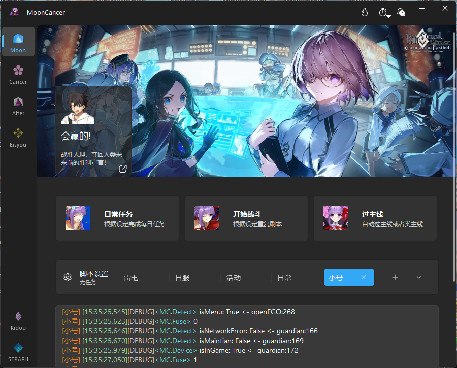
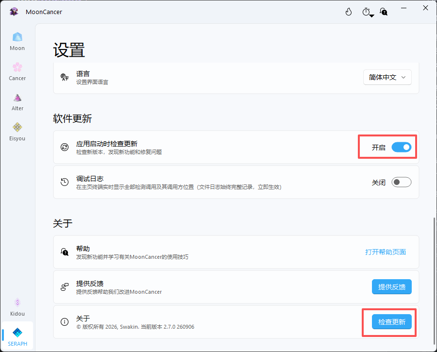
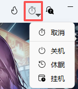
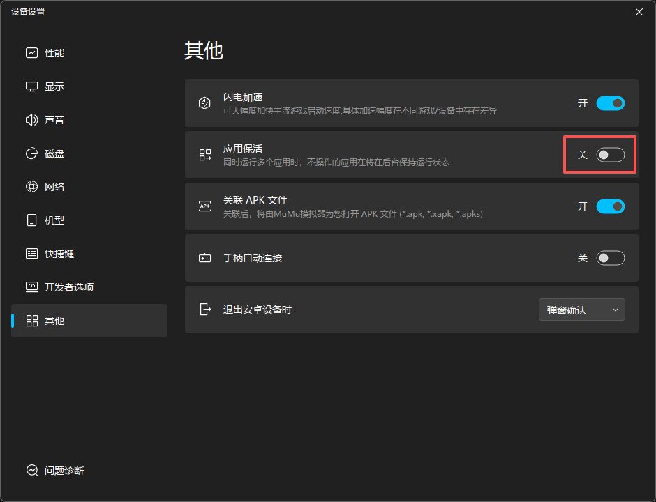
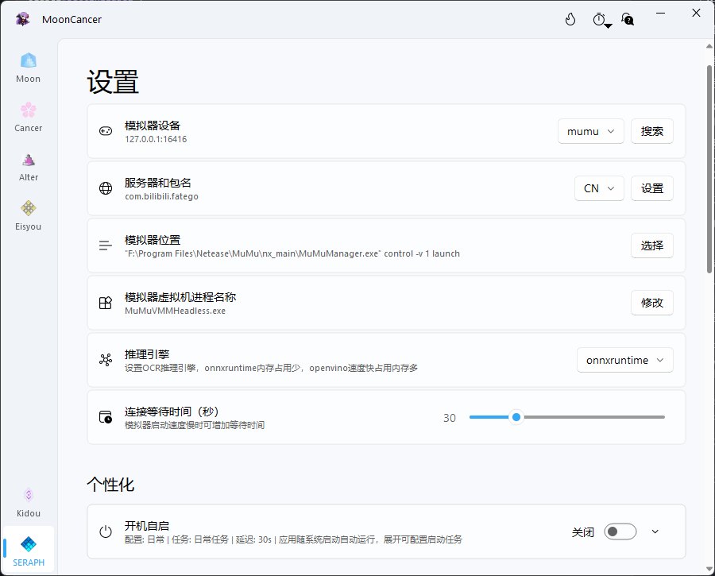
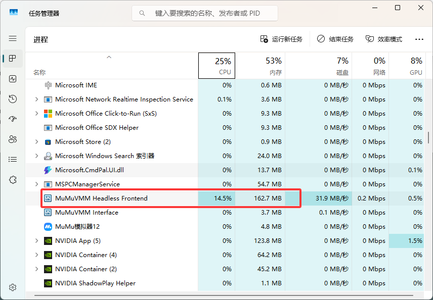

<font size=5>**配置不够？不能满羁绊？刷本太慢？<br>真拿你没办法，前辈 ❤，让 BB 亲来帮你吧**</font>

## 功能特性

- **自动战斗**：编队 → 选助战 → 指令卡/宝具循环 → 结算 → 连续作战，支持周回、主线、自由本、首通、日常任务（白纸化地球 / 冠位戴冠战）
- **多模拟器支持**：专门适配MuMu模拟器、雷电模拟器，其他模拟器任然可用
- **多开支持**：多个配置方案可同时运行任务，设备、调度、日志按配置隔离；同一模拟器/进程不会被重复驱动，多个同名进程时弹窗选择
- **图像识别**：OpenCV 模板匹配 + RapidOCR 文字识别，推理引擎可选 onnxruntime / openvino
- **战斗辅组**：基于 pymem 特征码扫描，支持修改攻击/生命/NP、快速强化、清空敌方血条
- **任务调度**：任务完成后可计划关机/休眠，多开时延迟到最后一个任务结束，支持挂机循环（按 AP 自动等待）
- **守护机制**：断线重连、游戏崩溃自动重启、维护检测、连续失败熔断（自动保存现场截图）
- **其他**：多配置方案、每日免费抽卡、剧情 TTS 朗读、开机自启、系统托盘、中/繁/英/日多语言、自动检查更新

## 功能简介

- [`日常任务`](../mooncancer1#日常任务)：打开模拟器，打开游戏，抽每日友情池，打白纸化或戴冠战结束
- [`开始战斗`](../mooncancer1#开始战斗)：无烦恼刷各种周回或完成当前战斗
- [`过主线`](../mooncancer1#过主线)：自动过主线，可以选择朗读剧情，或者跳过剧情
- [`清理free本`](../mooncancer1#清理free本)：自动清理free本(We Are Free!)
- [`首通关卡`](../mooncancer1#首通关卡)：清理幕间，进阶关卡，回忆关卡等一切需要通关拿奖励的情况
- [`Cancer`](../mooncancer2)：局内数值修改器，只能在战斗中使用，用来手动修改数值
- [`Alter`](../mooncancer3)：提供更灵活的方式修改局内数值，主要用来打圣杯战线
- [`Eisyou`](../mooncancer4)：随机分配角色朗读剧情，可以挂着当相声听
- `Kidou`：打开模拟，再打开游戏进入到主界面

**只支持国服和日服安卓模拟器使用（能在模拟器上登录即可用，包括渠道服、IOS也可也在模拟器上登录）**
:::warning
有些问题懂的都懂不要到处传播，打枪滴不要，请勿上纲上线。 仅供学习交流使用，请自行承担游戏账号相关风险。
:::
---
:::warning
[&lt;&lt;哔哩哔哩游戏平台用户协议&gt;&gt;](https://yhxy.biligame.com/)第 11 条第 2 款规定
用户不得通过不正当的手段或其他不公平的手段使用本平台游戏、本平台服务或参与本平台活动。
用户不得干扰本平台正常地提供游戏和服务，包括但不限于：攻击、侵入本平台的网站服务器，或集中时间段内以超出正常用户登录需求的高频率登录或尝试登录服务器从而使网站服务器过载；破解、修改本平台游戏程序；攻击、侵入本平台游戏的服务器/游戏服务器端程序或使游戏服务器过载；制作、发布、传播、使用任何形式的妨碍游戏公平性的辅助工具或程序（包括但不限于“外挂”, “外挂”是指独立于游戏软件之外的，能够在游戏运行的同时影响游戏操作的所有程序，包括但不限于模拟用户操作、改变操作环境、修改数据等一切类型）。用户不得：利用程序的漏洞和错误(Bug)破坏游戏的正常进行或传播该漏洞或错误(Bug)；不合理地干扰或阻碍他人使用本平台游戏和本平台服务；通过异常或者非法的方式使用本平台游戏(包括但不限于利用本平台游戏登录游戏私服)；使用异常的方法登录游戏（包括但不限于使用非本平台开发、授权或认可的第三方软件、系统登录游戏）、使用网络加速器等外挂软件或机器人程序等恶意破坏服务设施、扰乱正常服务秩序的行为；修改、翻译、注释、整理、汇编、演绎本平台游戏；利用本平台游戏或者本平台服务可能存在的技术缺陷或漏洞而以各种形式为自己及他人牟利（包括但不限于复制游戏虚拟物品等）或者从事其他不正当行为等。
:::

## 界面展示


## 下载安装

[GitHub Release](https://github.com/SwakinX/MoonCancerLauncher/releases/tag/Download)

[国内下载](https://gitee.com/swakinx/mcassets/releases/download/Download/Updater.exe)

下载`Updater.exe`，新建一个文件夹，将文件放到里面，例如`MoonCaner/Updater.exe`，然后运行`Updater.exe`，就会自动下载安装，同时也是更新程序
## 更新方式
- 自动检测更新，在设置中开启自动检测更新
- 手动检测更新，在设置->关于->检查更新

- 运行程序根目录的`Updater.exe`
## 使用说明
- 先同时运行模拟器和Moon Cancer，在Seraph(设置)中先选中你的模拟器类型，然后点搜索，成功的话选择对应的设备，下面的设置就会自动设置完成，日服或渠道服还需要更改服务器类型然后点设置更改包名。具体设置说明请看[连接设置](#连接设置)，然后根据需求设置好[脚本设置](../mooncancer1#脚本设置)就可以点击[对应功能](../mooncancer1#基本功能)运行脚本了
- 点击下面链接可查看每个界面具体说明：<br>
[Moon界面说明](../mooncancer1)<br>
[Cancer界面说明](../mooncancer2)<br>
[Alter界面说明](../mooncancer3)<br>
[Eisyou界面说明](../mooncancer4)<br>
### 标题栏说明
- 右上角的帮助图标可以打开`帮助`弹窗，有问题随时可以查看点击跳转对应的说明书，如果觉得有帮助可以赞助我一点。<br>
- 右上角左边`强制结束`按钮，可以一键结束所有配置的任务并重置设备连接，脚本卡住的时候用它。<br>

- 任意时候都可以点击计划按钮选择计划或取消计划，关机会在所有任务结束后才关机（多开时等最后一个任务结束），休眠同理；挂机会在任务结束后，挂机等待体力够进入当前关卡，建议使用时开启`清理剩余体力`选项<br>

### 模拟器设置
- 使用其他模拟器理论上可行，但推荐MuMu或雷电，这两个适配了高速连接，本身玩fgo也比较稳定，MuMu现在官网已经只能下载到新版了，想用旧版这里有历史版本[MuMu模拟器历史版本](https://www.cnblogs.com/wutou/p/18165628)，**MuMu不要用安卓15版本的，修改可能无法生效**
- 模拟器用16：9的分辨率，1280x720起步，分辨率过低可能无法识别，最重要的mumu模拟器`关闭`后台保活,一定要`关闭`，记住是`关闭`，如下图所示。其他模拟器可能也有一些导致无法正常截图的设置


### 连接设置
:::important
请在设置之前打开要使用的模拟器；修改数值时如果检测到多个同名模拟器进程，会弹窗让你选择要附加的进程，已经被其他配置占用的进程会标记并禁选。

按下图标记顺序完成设置即可连接设备，如果是mumu模拟器B服，只需要进行第2步搜索设备选择确认即可。

如果是其他情况，例如雷电模拟器日服，那就要按1234的顺序设置，56只要第2步自动填入了内容就用管。
:::

- `模拟器设备`列表里有的都支持自动搜索，没有就选other，这里选MuMu和雷电的话默认使用高速连接，切换到other时只要参数正确也能正常使用adb连接；如果高速连接出现问题可以切换到other使用默认连接方式，`如果是新版MuMu只能选mumu才能正常使用`。<br>
可以自动搜索已经在运行的模拟器，自动搜索设备并设置好所有参数理论支持MuMu、雷电、蓝叠、逍遥、夜神，但只测试了MuMu和雷电，搜不到就自己输入对应的参数，端口上网搜XX模拟器端口，连接问题可以参考[BBChannel](https://www.bilibili.com/opus/605452889655035035?spm_id_from=333.999.0.0)的相关说明。**注意，如果自动搜索成功就不要动下面的模拟器位置和虚拟机进程名称**
- `服务器和包名`可以选择国服和日服，更改后请设置包名。包名默认是B服，其他客户端要修改，设置好连接参数后，打开模拟器后能自动搜索，搜索失败就自己填了
:::warning
自动搜索并成功设置的情况下不要动`模拟器位置`和`虚拟机进程名称`这两项，除非你知道自己在干什么
:::
- `模拟器位置`是用来启动模拟器的命令，一般选择模拟主器程序的位置就行了，也可也自己加参数，自动搜索的是带参数的
- `虚拟机进程名称`是读取内存的目标，是修改的基础，**没填或没填对脚本没法正常工作**，默认就是mumu模拟器的
- `推理引擎`设置OCR推理引擎，onnxruntime内存占用少，openvino速度快占用内存多，如果没有问题建议朗读时追求速度再切换openvino
- `连接等待时间`如果自动启动模拟器时，模拟器启动时间过长导致没连上，可以增加等待时间
- `开机自启`可以选择配置和日常任务，在电脑系统启动后自动执行日常任务
- 剩下的设置没啥好讲的了，自己看着选
:::tip
这里简单说一下怎么找到自己模拟器的虚拟机名称，打开模拟器，再打开任务管理，在进程里找到占用最高的模拟器相关进程(这里以mumu为例)，右键打开文件所在的位置，就可以直到程序，复制名称就行了，要包括.exe。
或者直接问AI一般也能得到一个比较准确的答案，可以参考着找一下，就问 **XX模拟器的虚拟机进程名称是什么**

:::

### 游戏内设置
- 记得打开**筛选**（我该不会是最后一个知道的吧），**加快敌人消失速度**，**战斗二倍速**。筛选可以减少找到目标礼装的时间，不过现在羁绊礼装太多，午茶反而排到羁绊礼装的最后面去了


## 其他问题
- 如果开始后连接出现如下错误，而且执行的非常慢，请先卸载模拟器内的`yosemite`应用，然后重试

```log
[17:16:03][ERROR]<airtest.core.android.cap_methods.screen_proxy> OSError('socket connection broken')
[17:16:03][ERROR]<airtest.core.android.cap_methods.screen_proxy> Javacap setup up failed!
```

- 如果同时使用BBChannel，反复出现上诉问题，将`MoonCancer\assets\static`文件夹复制到BBchannel里面的`dist\BBchannel64\airtest\core\android\static`覆盖，这个方式同样能解决BBChannel的连接问题
## 问题反馈
- 遇到错误请在这里[反馈](https://github.com/SwakinX/MoonCancerLauncher/issues)，尽量在出现问题的地方截屏或录屏，并给出log以及场景描述，出问题的时候会自己截图有的话也带上，最好用模拟器自带的方式截屏和录屏

