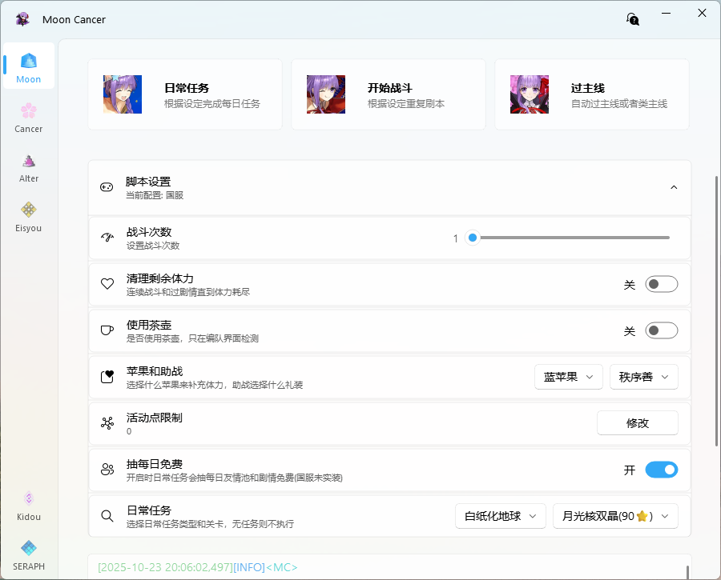

*MoonCaner脚本的启动界面，点击 `会赢的`标签会打开我的博客* 

## 基本功能

### 日常任务

整个流程包括打开模拟器(需要设置模拟器路径)，启动游戏，抽每日免费友情池(可关闭)，完成每日三次白纸化(设置中的本)。可以在主界面或者只运行了模拟器开始。每天可以直接点一下就下线，长草期也不麻烦，轻松攒石头 

### 开始战斗

自动刷各种本，主要是能连续战斗的，或是强化本或者free本那样回到主界面右上角也有本可以点的情况，在Seraph(设置)里设置好战斗次数，礼装类型，是否要清理剩余体力，就可以点击开始了。可以在进入战斗前的选择助战，队伍设置和进入战斗后开始，也可以在主界面选本界面开始，但要保证要刷的本在第一个位置。 

### 过主线

自动过主线和类主线，自动完成期间的战斗，**不要改变地图缩放，保持进入地图后的默认缩放，有缩放过的重新进图**，保障屏幕里表示主线任务的 `下一个`标识存在即可点击开始，部分情况会卡住，需要手动修正，选取消跳过剧情时会自动朗读剧情，相关配置可以到Eisyou界面修改，具体说明请看[Eisyou界面说明](../mooncancer4) 
测试到的可能需要手动干涉部分： 

- **第四特异点** 雾遮挡标志  
- **第六特异点** 风沙遮挡标志  
- **第七特异点** 提亚马特遮挡标志  
- **终局特异点** 柱子站之前剧情过完就没有标志了，要自己去把柱子战过了  
- **LostBelt No.2**  6.4关卡要求出战马修，自动编成会打乱原本编队，就不自动了，自己先编好马修吧，不想中断就一直带着
- **LostBelt No.5亚特兰蒂斯**  11-2关卡要求出战马修，自动编成会打乱原本编队
- **LostBelt No.5奥林波斯**  2-1、2-2、5-1、6-3、12-2关卡要求出战马修，自动编成会打乱原本编队
- **LostBelt No.6阿瓦隆**  18-5需要手动放妖兰群体宝具，24-6需要送死
- **LostBelt No.7**  1-2关卡要求出战马修，部分关卡会卡住，太小了找不到`下一个`就放大地图，ort最终战建议手动，自动可能从者不够用卡关
- **奏章二**  中途有多选项找线索
:::tip
这里说下我使用的方式
- 不想看剧情直接选择跳过
- 想慢慢听就选不跳过挂着
- 想快点看完就自己点屏幕快速浏览剧情，期间只用在有剧情时点屏幕，或者手动拖动下一个剧情点到屏幕中央，其他流程都交给脚本自动点击即可（也可以自己点下助战），这样既能快速过剧情，还有部分句子的语音强化记忆，还能自动战斗，不用自己去点战斗。我觉得挺舒服的。
:::
### 清理free本

自动清理free本(We Are Free!)。同样**不要改变地图缩放，保持进入地图后的默认缩放，有缩放过的重新进图**，进入地图就可以点开始了，**第七异闻带**  地图不适配，可以手动选关卡，固定三次战斗完成

## 脚本设置
设置主页运行任务的具体参数，可展开折叠

- **战斗次数** 如果拖动不精准可以键盘左右键微调，日常任务默认打三次，屯着多次的要一次打完可以直接用战斗设置次数打，过剧情除非开启清理剩余体力，不然会不停过，跟这里的战斗次数无关
- **清理剩余体力** 开启后，所有战斗都会在战斗次数耗尽后，战斗到体力不足
- **使用茶壶** 每次编队界面检查茶壶使用状态
- **苹果** 按需选择即可
- **助战礼装** 按需设置即可，活动礼装默认选择第一个，把助战筛选设置好就行了
- **活动点限制** 设置活动点限制，超过就停止，不多刷浪费，不限制时设为0，没有活动点的情况不触发
- **抽每日友情池** 开启会在日常任务打白纸化之前先抽取每日免费友情池
- **白纸化任务** 选择每日刷的本，按需选取，但要注意是否已经开放

## 日志窗口
出现问题时可简单用查看情况