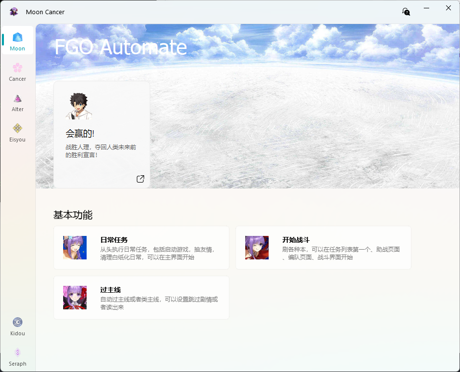

<font size=5>**配置不够？不能满羁绊？刷本太慢？真拿你没办法，前辈 ❤，让 BB 亲来帮你吧**</font>

## 功能简介

- **日常任务**：打开模拟器，打开游戏，抽每日友情池，清理白纸化副本结束，也可以在主页开始
- **开始战斗**：无烦恼刷各种副本，复杂的机制关可能不能正常通关，建议手动修改根据机制来完成战斗
- **过主线**：自动过主线，可以选择朗读剧情，或者跳过剧情，部分情况可以要手动调整重新启动任务
- **cheat**：局内数值修改器，只能在战斗中使用，用来手动修改数值
- **alter**：提供更灵活的方式修改局内数值，主要用来打圣杯战线
- **eisyou**：随机分配角色朗读剧情，可以挂着当相声听
- **start**：打开模拟，再打开游戏进入到主界面，再次点击可以取消

**只支持国服安卓模拟器使用（能在模拟器上登录即可用）**

**有些问题懂的都懂不要到处传播，打枪滴不要，也不要上纲上线**
**我只是为了轻松的玩 FGO，怕别用，用别怕。**

---

:::warning
[&lt;&lt;哔哩哔哩游戏平台用户协议&gt;&gt;](https://yhxy.biligame.com/)第 11 条第 2 款规定
用户不得通过不正当的手段或其他不公平的手段使用本平台游戏、本平台服务或参与本平台活动。
用户不得干扰本平台正常地提供游戏和服务，包括但不限于：攻击、侵入本平台的网站服务器，或集中时间段内以超出正常用户登录需求的高频率登录或尝试登录服务器从而使网站服务器过载；破解、修改本平台游戏程序；攻击、侵入本平台游戏的服务器/游戏服务器端程序或使游戏服务器过载；制作、发布、传播、使用任何形式的妨碍游戏公平性的辅助工具或程序(包括但不限于“外挂”, “外挂”是指独立于游戏软件之外的，能够在游戏运行的同时影响游戏操作的所有程序，包括但不限于模拟用户操作、改变操作环境、修改数据等一切类型）。用户不得：利用程序的漏洞和错误(Bug)破坏游戏的正常进行或传播该漏洞或错误(Bug)；不合理地干扰或阻碍他人使用本平台游戏和本平台服务；通过异常或者非法的方式使用本平台游戏(包括但不限于利用本平台游戏登录游戏私服)；使用异常的方法登录游戏（包括但不限于使用非本平台开发、授权或认可的第三方软件、系统登录游戏）、使用网络加速器等外挂软件或机器人程序等恶意破坏服务设施、扰乱正常服务秩序的行为；修改、翻译、注释、整理、汇编、演绎本平台游戏；利用本平台游戏或者本平台服务可能存在的技术缺陷或漏洞而以各种形式为自己及他人牟利（包括但不限于复制游戏虚拟物品等）或者从事其他不正当行为等。
:::

## 界面展示



[MoonCancer 局内修改器](../mooncancer局内修改器/)

## 注意事项

- 使用先修改设置，更新保留[配置文件](config/config.json)(config/config.json)并替换
- 模拟器用 16：9 的分辨率，1920x1080 起步，分辨率过低可能无法识别，最重要的关闭后台保活，其他模拟器如果发现不能正常识别也看看有没有类似的功能
- 软件设置，设置好自己的模拟器主程序路径，模拟器虚拟机进程名称，模拟器端口，端口上网搜 XX 模拟器端口，连接问题可以参考[BBChannel](https://www.bilibili.com/opus/605452889655035035?spm_id_from=333.999.0.0)
- 战斗次数通用，除了周回会有其他结束条件，更换了满级羁绊识别方式，不确定是否每个阶段都能生效
- 战斗模式分两中，一个是二号位带任意光炮就行，一个则没有要求，不公容易导致游戏闪退，自己体会
- 礼装默认羁绊礼装，需要用活动礼装自己截图替换这个[目录](equip/活动礼装1.png)(equip/活动礼装 1.png)下的对应图片(注意是 png)，最多三种感觉够用了，放大截清晰点
- 记得打开筛选（我该不会是最后一个知道的吧）
- 日常可以在没启动模拟器或游戏的时候开始，也可以在主界面开始
- 周回和 BBChannel 一样在助战，战斗，和选队伍界面开始
- 清理 free 本在进入关卡前开始且满足如下图条件，理论上可以一次打完所有强化本
- 如果开始后连接出现如下错误，而且执行的非常慢，请先卸载模拟器内的，然后重试

> [17:16:03][ERROR]<airtest.core.android.cap_methods.screen_proxy> OSError('socket connection broken')
> [17:16:03][ERROR]<airtest.core.android.cap_methods.screen_proxy> Javacap setup up failed!

- 遇到错误请在 [Issue](https://github.com/SwakinX/MoonCancer/issues) 反馈，提问讨论可以在 QQ 群 [150148670](https://qm.qq.com/q/sHyXN2qXbU)

## 下载安装

群文件下载

前往 [Releases](https://github.com/SwakinX/MoonCancer/releases) 下载后解压双击 BB 图标的 `MoonCancer.exe` 打开图形界面

<details>
<summary>开发相关</summary>

有这个想法已经几年了终于是实现了，第一次写这么正式的项目，只能说有编程基础，摸着石头过河，写的很烂

---

## 相关项目

MoonCancer 离不开以下开源项目的帮助：

- 三月七小助手 [https://github.com/moesnow/March7thAssistant](https://github.com/moesnow/March7thAssistant)
- BBChannel [https://github.com/xiaoruanmm/FGOautomation-BBchannel-](https://github.com/xiaoruanmm/FGOautomation-BBchannel-)
- 自动化测试库 [https://github.com/AirtestProject/Airtest](https://github.com/AirtestProject/Airtest)
- OCR 文字识别 [https://github.com/hiroi-sora/PaddleOCR-json](https://github.com/hiroi-sora/PaddleOCR-json)
- 图形界面组件库 [https://github.com/zhiyiYo/PyQt-Fluent-Widgets](https://github.com/zhiyiYo/PyQt-Fluent-Widgets)

```

```
