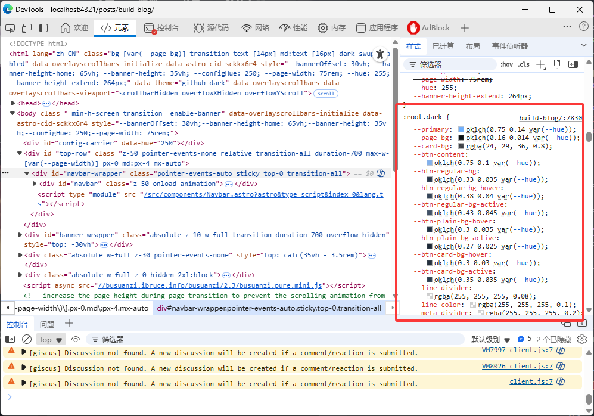

想搭建博客是想做一个MoonCancer的文档，用在线文档还是有点麻烦感觉，想要一个地方能集中管理，而且也想有一个地方来放我的经验和想法，于是这个博客就成了。
## 前言
为了搭建这个博客也是折腾了一两天，先是做功课，有什么框架模版，那些平台上能搭建种种。一开始我是想用Hexo的这个主题的，也是先尝试搭建了一下，按着步骤很快成功了
::github{repo="saicaca/hexo-theme-vivia"}
但是就在这时我注意到作者说这个仓库不更新了，建议使用新的模版，看了下这个确实比老的好，虽然框架不一样
::github{repo="saicaca/fuwari"}
但才刚刚开始，还是一开始就用新的比较好，于是又开始捣鼓这个模版，有了之前的经验，很快就在本地测试成功了,但部署遇到些问题，最后折腾到半夜终于成了。

在这之前看了一篇博客[手把手搭建 Astro + Github Pages + Github Actions](https://bxgldh.github.io/posts/how_to_build/)，想看具体操作可以看一下，和我用的同一套模版也是部署在GitHub，我刚在他博客下面评论完就发现部署成功了，虽然在搭建上面没帮上忙，但里面还是提到了如何添加浏览量和评论，我也就顺便借鉴了一下。


说了这么多放上我遇到的问题和一些经验吧。

## 部署配置
这是我踩的一个大坑，在[官方文档](https://docs.astro.build/en/guides/deploy/github/)中提到，`astro.config.mjs`配置文件中`base`字段要填仓库名称，但这里指的是GitHub项目网站要填，个人网站是不用填的，在这之前我看过视频还有一些博客说过，个人或组织网站的域名就是本身，这里官方文档没有特别说明导致我来回采坑。

```js title= "astro.config.mjs" {5}
import { defineConfig } from 'astro/config'

export default defineConfig({
  site: 'https://astronaut.github.io',
  base: 'my-repo',
})
```
我想搭建的也是个人网站，所以我觉得`base`是不用填的，实际上一开始测试的时候就是没填，但我测试的时候是刚fork来的，这时部署那就是项目网站，是要填`base`的，我部署上没有样式，给我整蒙了，怀疑是没加`basse`导致的所以又把`base`给加上，但同时我迁移到了个人网站仓库部署了，结果显示出来还是一样没有样式，这下给我整不会了。几经折腾还是回到原点，怀疑是`base`设置问题，我还原回了`'/'`，就推送等自动部署然后洗澡去了，洗完澡回来刷新一看，终于成功了，这时已经快凌晨两点了，好在能安心睡觉了。

## 草稿切换
在md文章的文件头里有一个选项`draft`，就是用来判断是否是草稿的(吃了没有文化的亏，没查意思之前都不知道)，一开始我的文章设置的都是`true`，测试的时候都在发布后却没有，也没用看到哪里有这个字段的说明(~~其实示例文章里就有~~)，结果就是发布后文章不见了。设置成`false`重新发布就好了。模版自带的几篇文章也不用删设置成`true`就行了。

## 透明背景
可以看到我的导航栏和背景是半透明的，我觉得导航栏挡道banner了不舒服，就想调整成半透明的，但模版没有提供这个选项，只能自己想办法了。 


很简单，<kbd>F12</kbd>打开开发工具，选取导航栏定位到导航栏代码，在右侧的样式里找到颜色的配置项，关闭或调整颜色值看效果就知道那个是需要修改的颜色了，我用的这个模版使用的颜色名称是`--card-bg`

然后在`src\styles\variables.styl`中找倒这个变量名称，修改成带透明度的颜色值就行了，思路是这样，我这里修改的值为
```styl title="src\styles\variables.styl"
--card-bg: white(0.8) rgba(24 29 36 0.8)
```
原本的`oklch`形式加上透明度就错误，我直接转换为`agba`了，不同模版可能不一样，黑白模式的值可能是分开存的，这里存在一起的。